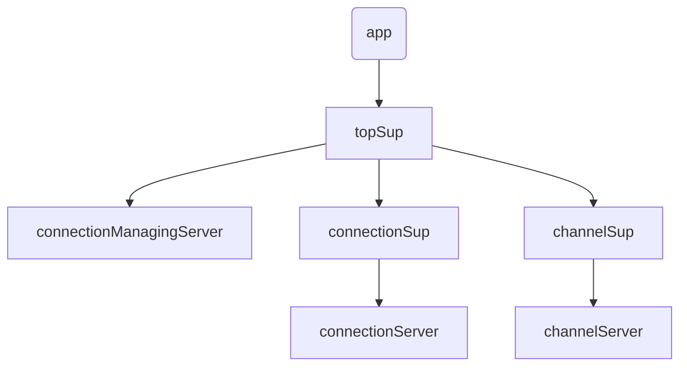

# go-rigger-amqp
go-rigger-amqp 将github.com/streadway/amqp封装成了actor模式/接口

## 引入
go get github.con/saintEvol/go-rigger-amqp

## 应用进程树:


## 使用
+ 连接MQ
 ```golang
		connection, err := riggerAmqp.Connect(riggerAmqp.ConnectConfig{
			Tag:      "test-consume",
			Host:     "localhost",
			Port:     5672,
			User:     "admin",
			Password: "admin",
		})

```
+ 打开信道
  ```golang
   // 可以多次调用以打开多个信道
	channel, err := connection.OpenChannel()
  ```
+ 声明交换机
  ```golang
  err = channel.ExchangeDeclare(&riggerAmqp.ExchangeDeclareConfig{
			Name:       "rigger-amqp-test",
			Kind:       riggerAmqp.ExchangeKindDirect, // "direct"类型的交换机
			IsPassive:  false,
			Durable:    true,
			AutoDelete: false,
			Internal:   false,
			NoWait:     false,
			Args:       nil,
		})
  ```
  + 声明队列
+ ```golang
  channel.QueueDeclare(&riggerAmqp.QueueDeclareConfig{
			Name:       "rigger-amqp-test",
			Durable:    true,
			IsPassive:  false,
			AutoDelete: false,
			Exclusive:  false,
			NoWait:     false,
			Args:       nil,
		})
  ```
+ 绑定队列
```golang
err = channel.QueueBind(&riggerAmqp.QueueBindConfig {
			Name:     "rigger-amqp-test",
			Key:      "",
			Exchange: "rigger-amqp-test",
			NoWait:   false,
			Args:     nil,
		})
``` 
+ 发送消息:
  ```golang
  err = channel.Publish(&riggerAmqp.Publish{
			Exchange:  "rigger-amqp-test",
			Key:       "",
			Mandatory: false,
			Immediate: false,
			Message:   &amqp.Publishing{
				Headers:         nil,
				ContentType:     "",
				ContentEncoding: "",
				DeliveryMode:    0,
				Priority:        0,
				CorrelationId:   "",
				ReplyTo:         "",
				Expiration:      "",
				MessageId:       "",
				Timestamp:       time.Time{},
				Type:            "",
				UserId:          "",
				AppId:           "",
				Body:            []byte("test msg"),
			},
		})
  ```
+ 消费消息:
  ```golang
  channel.Consume(riggerAmqp.ConsumeConfig{
			Pid: consumerPid,
			Queue:     "rigger-amqp-test",
			Consumer:  "rigger-consumer-test",
			AutoAck:   false,
			Exclusive: false,
			NoLocal:   false,
			NoWait:    false,
			Args:      nil,
		})
  ```
