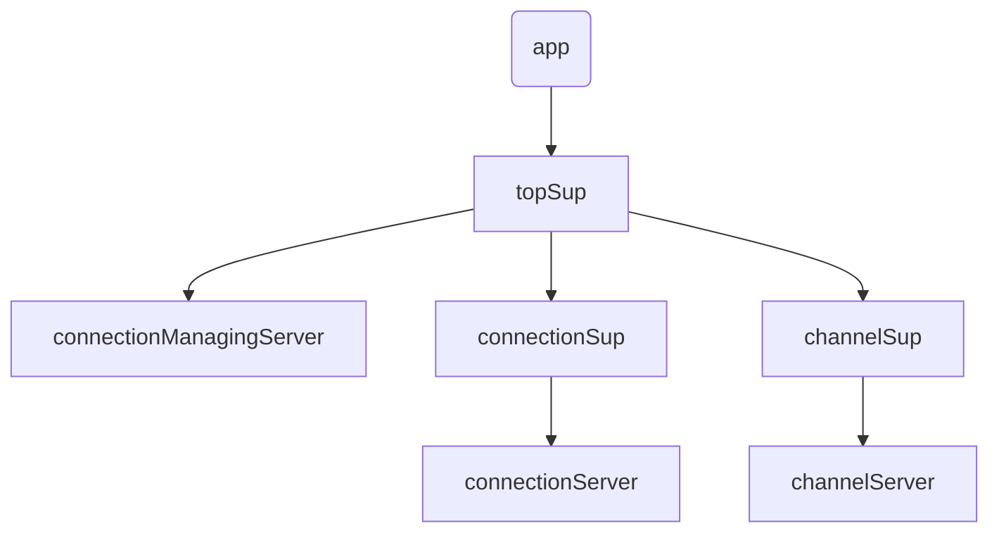

# go-rigger-amqp

```mermaid
graph TD
    app(app) --> topSup
    topSup --> connectionManagingServer
    topSup --> connectionSup
    connectionSup --> connectionServer
    topSup --> channelSup
    channelSup --> channelServer
```